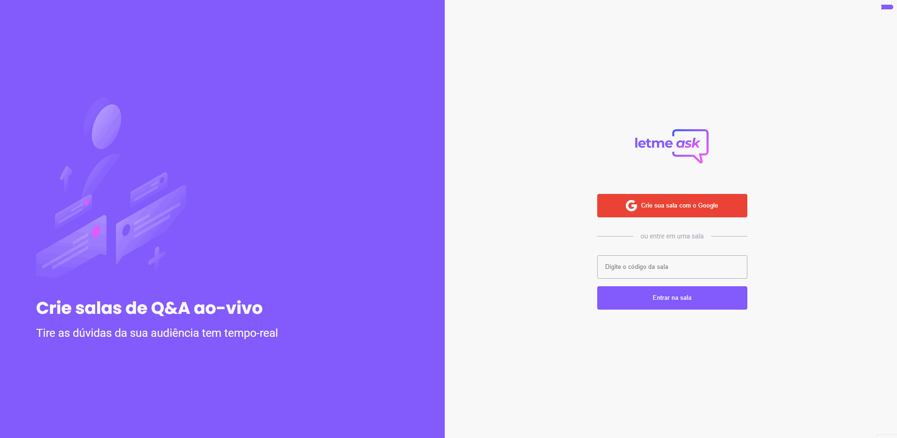
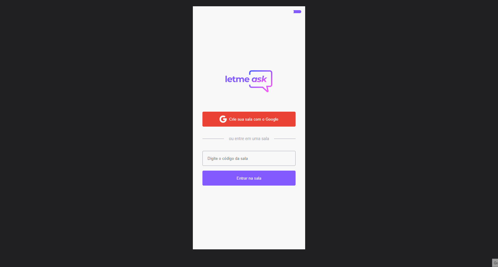

<div align="center">
  
</div>

## 💻 Sobre o projeto

Letmeask é uma aplicação com a proposta de que criadores de conteúdo criem salas de Q&A com o seu público, o projeto foi desenvolvido durante o NLW Together, um evento da plataforma **[Rocketseat](https://rocketseat.com.br/)**, para aumentar o desafio e aprendizado, fiz algumas coisas diferentes e implementei outras funcionalidades, utilizei ESLint e Prettier, optei por Styled Components na estilização, Adicionei modo escuro, fiz a aplicação completamente responsiva e utilizei bibliotecas para Toasts e Modal.

- **[Acesse o layout](https://www.figma.com/community/file/1009824839797878169/Letmeask)**
- **[Acesse a aplicação](https://letmeask-83c87.web.app/)**



---



---

## :hammer_and_wrench: Tecnologias utilizadas

- **[TypeScript](https://www.typescriptlang.org/)**
- **[React](https://pt-br.reactjs.org/)**
- **[Styled Components](https://styled-components.com/)**
- **[React Router DOM](https://reactrouter.com/core/guides/philosophy)**
- **[React Hot Toast](https://react-hot-toast.com/)**
- **[React Modal](https://github.com/reactjs/react-modal)**
- **[ESLint](https://eslint.org/)**
- **[Prettier](https://prettier.io/)**
- **[Firebase](https://firebase.google.com/?gclid=Cj0KCQjw_dWGBhDAARIsAMcYuJwt_7AFVLrdoNi0J_jN6ZrNAj3WCxd75Qx2MQVbNTmVLZhxUftrexIaAqzSEALw_wcB&gclsrc=aw.ds)**

---

## ⚙️ Executando o projeto

### Pré-requisitos

- **[GIT](https://git-scm.com/)**
- **[Node](https://nodejs.org/en/)**
- **[Yarn](https://classic.yarnpkg.com/en/docs/install/)**

**Clone o repositório**

```
git clone https://github.com/theandersonfonseca/letmeask.git
```

**Acesse a pasta do projeto**

```
cd letmeask
```

**Instale as dependências**

```
yarn
```

**Inicie a aplicação**

```
yarn start
```

---

Feito com 💜 por **[Anderson Fonseca](https://github.com/theandersonfonseca)**.
